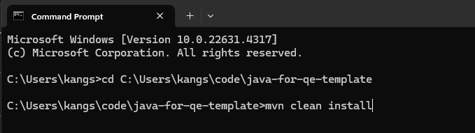
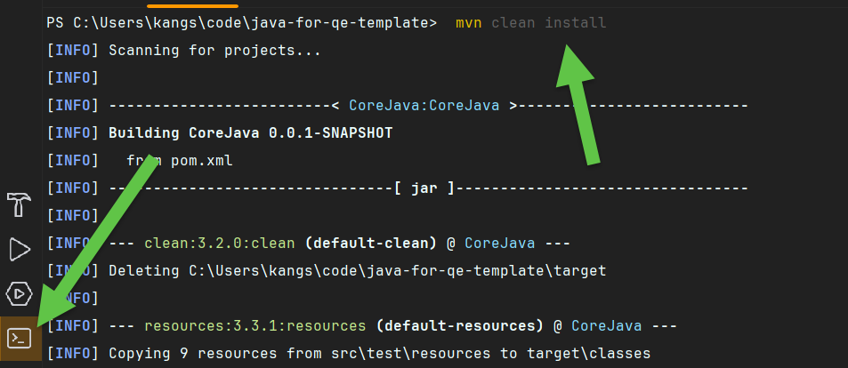
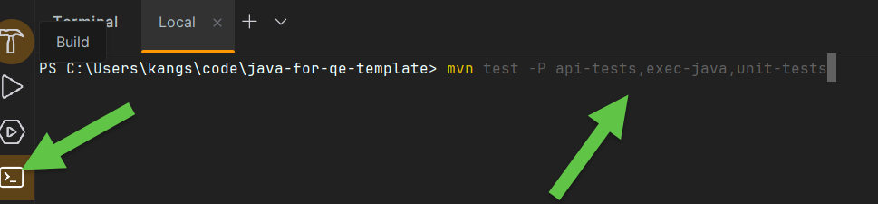
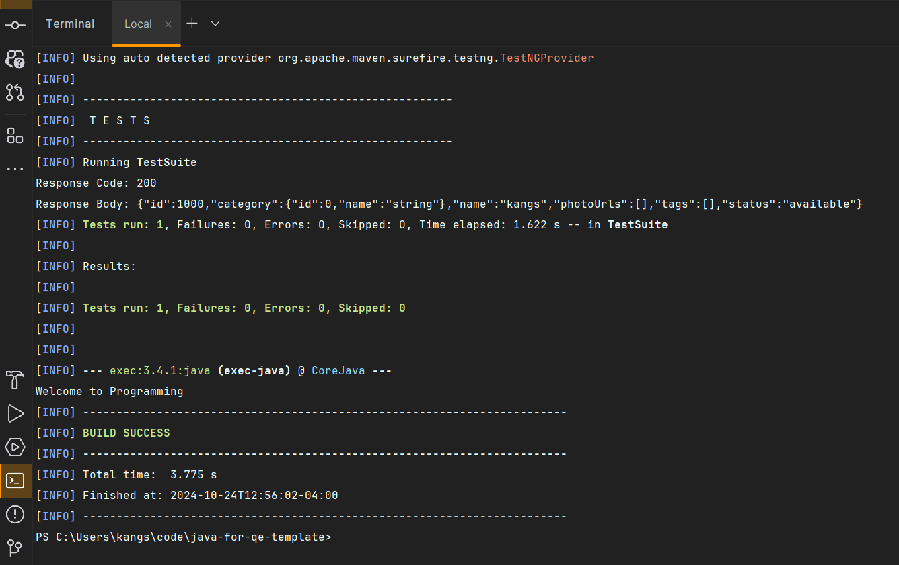
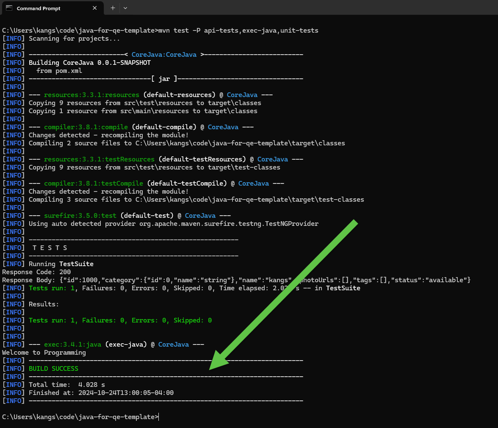

# java-for-qe-code

Java For QE Course Code base

## Installation Requirements

- Java 21 or higher
- Maven 3.6 or higher
- IDE (IntelliJ IDEA or Eclipse)—Latest version preferred
- Git

## Getting Started

1. Clone the repository:

   ```bash
   git clone git@github.com:kpassoubady/java-for-qe-template.git
   ```

or download the zip file and extract it.

1. Open the project in your IDE.
2. Go to `terminal` and navigate to the project directory.
3. Build the project using Maven:

```bash
mvn clean install
```

In Command Prompt

In IntelliJ IDEA


You should see Build Success at the end as shown below:


1. Run the tests:

```bash
mvn test -P api-tests,exec-java,unit-tests
```

In Command Prompt

In IntelliJ IDEA Editor


You should see the below `Build Success` message
In IntelliJ IDEA

In the command prompt:


## LinkedIn Profile

[Linked Profile Kangs](https://www.linkedin.com/in/kpassoubady/)
